# PBL3 - Gym & Sports Store Management System

## Introduction

PBL3 is an integrated web management application for gyms and sports stores developed using Full-stack technology. The system includes Spring Boot for backend API and HTML/CSS/JavaScript for frontend, providing comprehensive functionality for customer management, gym services, sports products, invoices, revenue, and statistics.

## 🏗️ Technologies Used

### Backend
- **Java 17** - Main programming language
- **Spring Boot 3.2.4** - Main framework
- **Spring Data JPA** - Data management
- **Spring Web** - REST API
- **Spring Validation** - Data validation
- **Hibernate 6.4.4** - ORM Framework
- **MySQL Connector** - Database driver
- **Lombok** - Reduce boilerplate code
- **Maven** - Dependency management

### Frontend
- **HTML5** - Web page structure
- **CSS3** - Styling and responsive design
- **JavaScript (ES6+)** - Frontend logic
- **Font Awesome** - Icon library
- **Google Fonts** (Montserrat, Oswald) - Typography

### Database
- **MySQL 8.0+** - Main database
- **Flyway** - Database Migration

## 🏛️ Project Structure

```
PBL3/
├── backend/                           # Spring Boot API
│   ├── src/main/
│   │   ├── java/PBL3/backend/
│   │   │   ├── controller/            # REST API Controllers
│   │   │   │   ├── AccountController.java
│   │   │   │   ├── KhachHangController.java  
│   │   │   │   ├── GoiDichVuController.java
│   │   │   │   ├── SanPhamController.java
│   │   │   │   ├── HoaDonController.java
│   │   │   │   ├── DoanhThuController.java
│   │   │   │   ├── ThongKeController.java
│   │   │   │   └── ...
│   │   │   ├── service/               # Business Logic Layer
│   │   │   ├── model/                 # Entity Classes
│   │   │   │   ├── Account.java
│   │   │   │   ├── KhachHang.java
│   │   │   │   ├── GoiDichVu.java
│   │   │   │   ├── SanPham.java
│   │   │   │   ├── HoaDon.java
│   │   │   │   ├── HoaDonChiTiet.java
│   │   │   │   ├── DoanhThu.java
│   │   │   │   └── ...
│   │   │   ├── repository/            # Data Access Layer
│   │   │   ├── dto/                   # Data Transfer Objects
│   │   │   └── config/                # Configuration Classes
│   │   └── resources/
│   │       ├── application.properties  # App configuration
│   │       └── db/migration/          # Database migrations
│   └── pom.xml                        # Maven dependencies
├── frontend/                          # Frontend Application
│   ├── pages/
│   │   ├── admin/                     # Admin interface
│   │   │   ├── home.html
│   │   │   ├── khachhang.html
│   │   │   ├── dichvu.html
│   │   │   ├── sanpham.html
│   │   │   ├── hoadon.html
│   │   │   ├── thongke.html
│   │   │   └── dangky.html
│   │   ├── khachhang/                 # Customer interface
│   │   └── trangchu/                  # Public pages
│   ├── css/                           # Stylesheets
│   ├── js/                            # JavaScript files
│   ├── assets/                        # Images and media
│   └── components/                    # Reusable components
└── README.md
```

## ✨ Main Features

### 🔐 Account Management & Authorization
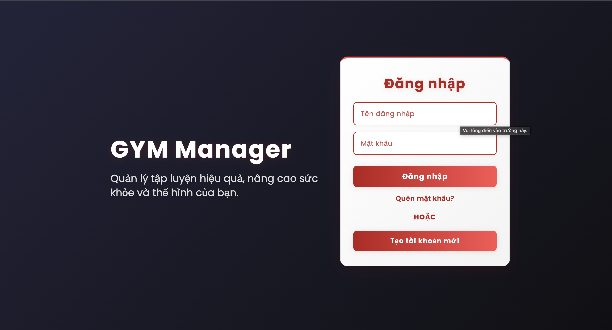

- System login/logout
- User role management: Admin, Customer
- Personal account information management

### 👥 Customer Management
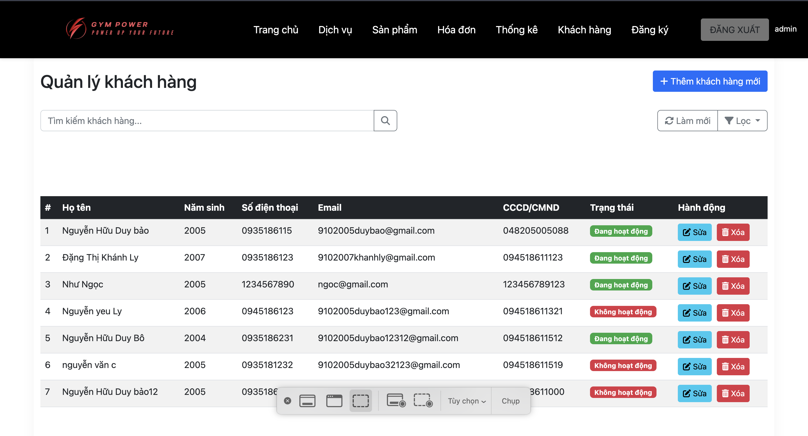
- Register new customers with complete information
- Update customer information (name, birth year, phone, ID card, email)
- Manage customer status
- Link accounts with customer information

### 🏋️ Gym Service Package Management
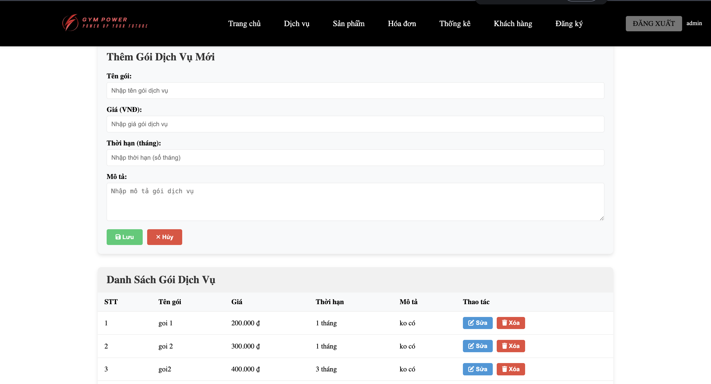
- Create and manage gym workout packages
- Set prices and duration for each package
- Register workout packages for customers
- Track remaining package time

### 🛍️ Product & Store Management
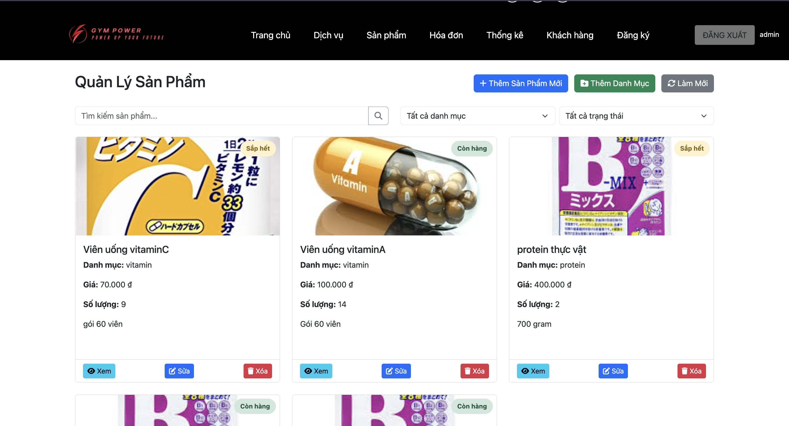
- **Product Category Management**: Create, edit, delete categories
- **Product Management**: 
  - Add new products with complete information (name, price, description, images)
  - Update product information
  - Inventory management: update quantity, stock in
  - Search products by name and category
- **Equipment Management**: Track gym equipment

### 🧾 Invoice & Payment Management
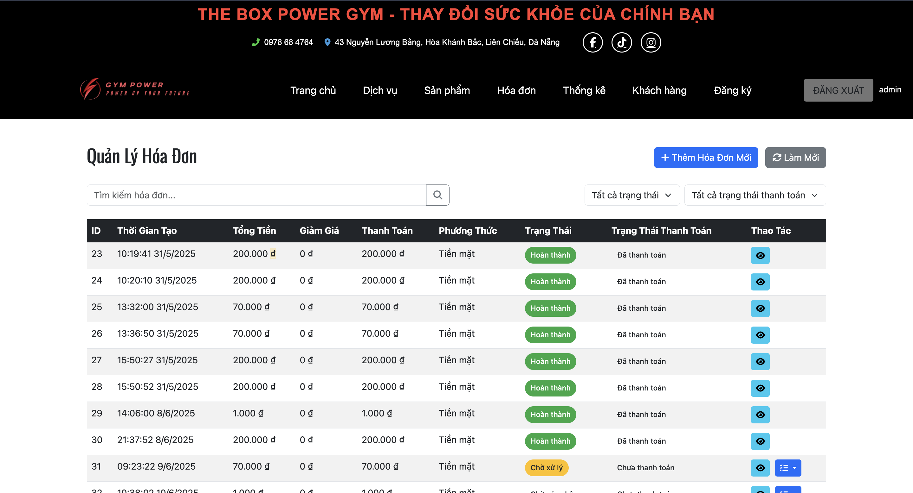

- **Create invoices**: For workout packages and product purchases
- **Invoice status management**: 
  - Completed / Incomplete
  - Paid / Unpaid
  - Cancel invoice
- **Invoice details**: Manage each product in the invoice
- **Invoice linking**: With customers and package registrations

### 📊 Revenue Statistics & Reports
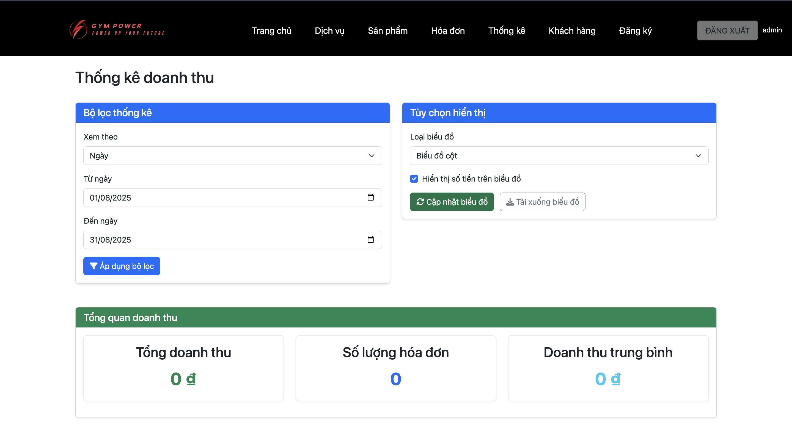
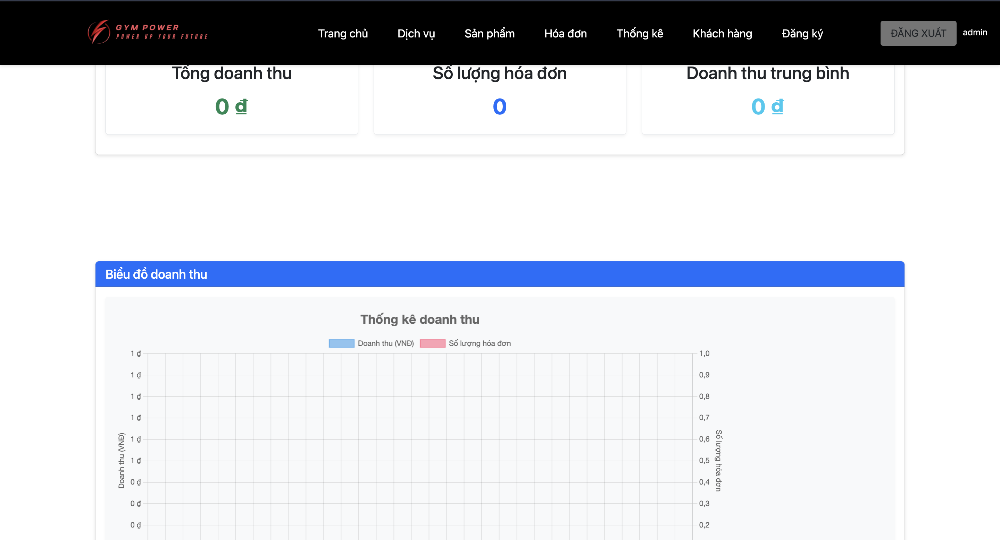
- **Revenue management**: Track total income and expenses by time
- **Time-based statistics**:
  - Daily revenue (from date to date)
  - Monthly revenue
  - Annual revenue
- **Revenue updates**: Add income and expenses to the system
- **Reports**: Export detailed revenue reports

### � Features for Customers (Users)

<div align="center">

#### 🏠 Customer Homepage


#### 🏋️ View and Register Service Packages
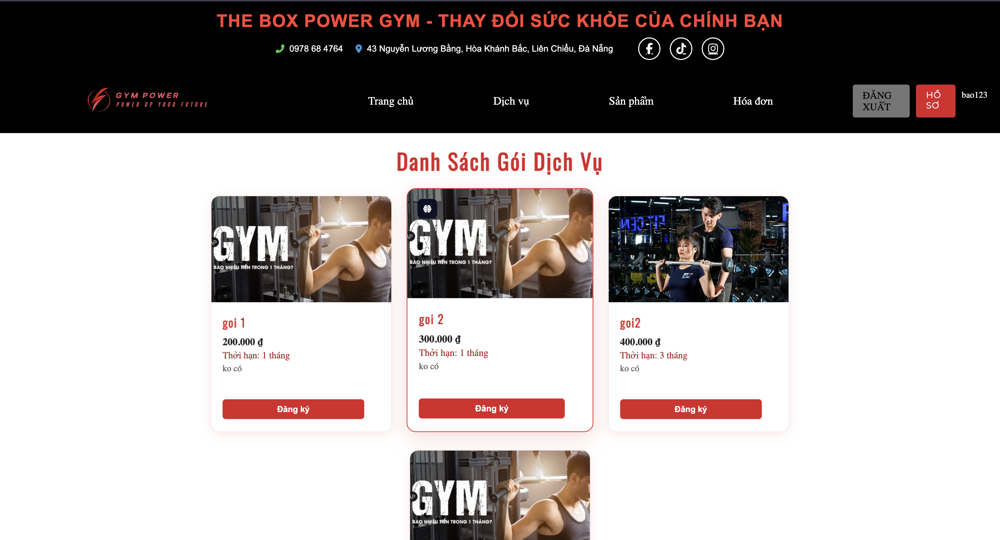
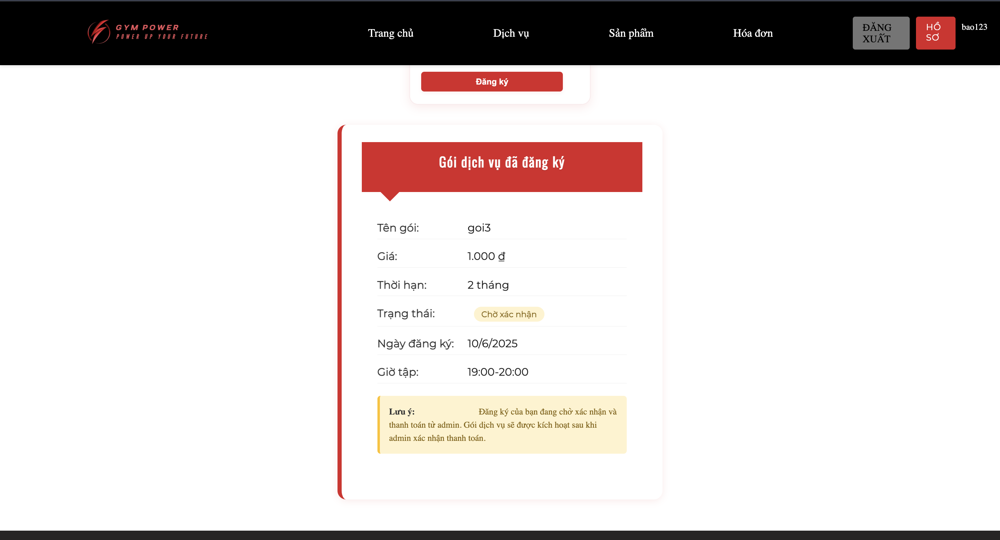

#### 🛒 Product Shopping
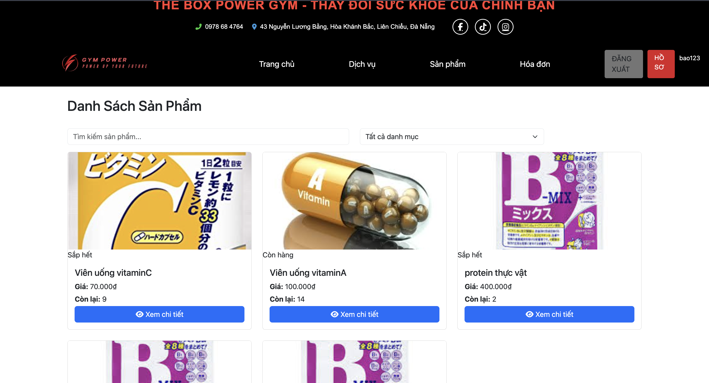

#### 🛒 Invoices
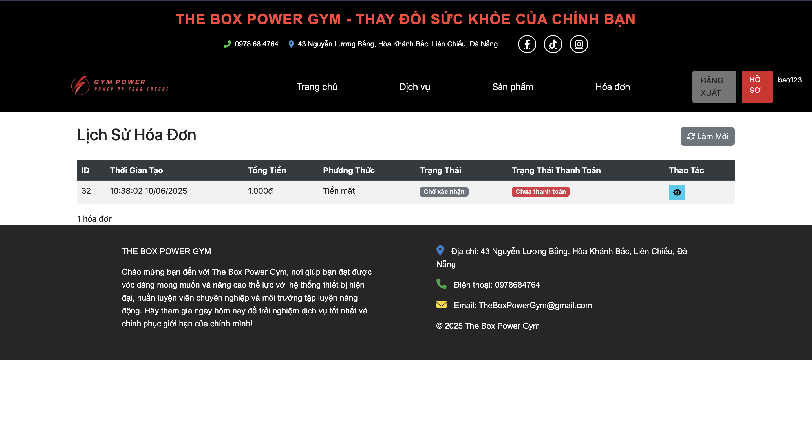

</div>

**Detailed features for customers:**
- ✅ **Register/Login**: Create account and access system
- ✅ **View service packages**: Browse available gym packages
- ✅ **Register workout packages**: Choose and register suitable packages
- ✅ **Product shopping**: Browse and buy sports products
- ✅ **Shopping cart management**: Add/remove products from cart
- ✅ **Payment**: Make payments for services and products
- ✅ **Profile management**: Update personal information
- ✅ **Registration history**: View registered packages
- ✅ **Purchase history**: Track orders and invoices

### 🖥️ Multi-role Interface
- **Admin Pages**: Complete system management
- **Customer Pages**: View services, register packages
- **Homepage**: Service introduction, login
- **Responsive design**: Mobile and desktop compatible

## 🚀 Installation and Running

### System Requirements


### 👤 Chức năng dành cho Khách hàng (User)

<div align="center">

#### 🏠 Trang chủ khách hàng


#### 🏋️ Xem và đăng ký gói dịch vụ


#### 🛒 Mua sắm sản phẩm


#### 🛒 Hoá đơn


</div>

**Chức năng chi tiết cho khách hàng:**
- ✅ **Đăng ký/Đăng nhập**: Tạo tài khoản và truy cập hệ thống
- ✅ **Xem gói dịch vụ**: Duyệt các gói tập gym có sẵn
- ✅ **Đăng ký gói tập**: Chọn và đăng ký gói phù hợp
- ✅ **Mua sắm sản phẩm**: Duyệt và mua các sản phẩm thể thao
- ✅ **Quản lý giỏ hàng**: Thêm/xóa sản phẩm khỏi giỏ hàng
- ✅ **Thanh toán**: Thực hiện thanh toán cho gói dịch vụ và sản phẩm
- ✅ **Quản lý hồ sơ**: Cập nhật thông tin cá nhân
- ✅ **Lịch sử đăng ký**: Xem các gói đã đăng ký
- ✅ **Lịch sử mua hàng**: Theo dõi đơn hàng và hóa đơn

### 🖥️ Giao diện đa vai trò
- **Trang Admin**: Quản lý toàn bộ hệ thống
- **Trang Khách hàng**: Xem dịch vụ, đăng ký gói tập
- **Trang chủ**: Giới thiệu dịch vụ, đăng nhập
- **Giao diện responsive**: Tương thích mobile và desktop

## 🚀 Cài đặt và chạy dự án

### Yêu cầu hệ thống
- Java JDK 17+
- Maven 3.6+
- MySQL 8.0+
- Modern Web Browser

### Step 1: Clone repository
```bash
git clone https://github.com/nvanan020804/PBL3.git
cd PBL3
```

### Step 2: Database Configuration
1. Create MySQL database:
```sql
CREATE DATABASE DATA2_PBL3;
```

2. Update configuration in `backend/src/main/resources/application.properties`:
```properties
spring.datasource.url=jdbc:mysql://localhost:3306/DATA2_PBL3?createDatabaseIfNotExist=true
spring.datasource.username=root
spring.datasource.password=your_password
```

### Step 3: Run Backend
```bash
cd backend
./mvnw spring-boot:run
```
```

Backend will run on: http://localhost:8080

### Step 4: Run Frontend
Open `frontend/pages/trangchu/index.html` in browser or use a web server:

```bash
cd frontend
python -m http.server 3000
# or
npx serve . -p 3000
```

Frontend will run on: http://localhost:3000

## 🔗 API Endpoints

### Customer (`/api/khachhang`)
- `GET /api/khachhang` - Get customer list
- `GET /api/khachhang/{id}` - Get customer information
- `POST /api/khachhang` - Create new customer
- `PUT /api/khachhang/{id}` - Update customer

### Service Packages (`/api/goidichvu`)
- `GET /api/goidichvu` - Get service package list
- `POST /api/goidichvu` - Create new service package
- `PUT /api/goidichvu/{id}` - Update service package

### Products (`/api/sanpham`)
- `GET /api/sanpham` - Get product list
- `GET /api/sanpham/{id}` - Get product information
- `GET /api/sanpham/danhmuc/{idDanhMuc}` - Get products by category
- `GET /api/sanpham/name/{tenSanPham}` - Find product by name
- `POST /api/sanpham` - Create new product
- `PUT /api/sanpham/{id}` - Update product
- `PUT /api/sanpham/{id}/soluong` - Update quantity
- `PUT /api/sanpham/{id}/nhaphang` - Stock in
- `DELETE /api/sanpham/{id}` - Delete product

### Categories (`/api/danhmuc`)
- `GET /api/danhmuc` - Get category list
- `POST /api/danhmuc` - Create new category
- `PUT /api/danhmuc/{id}` - Update category

### Invoices (`/api/hoadon`)
- `GET /api/hoadon` - Get invoice list
- `GET /api/hoadon/{id}` - Get invoice information
- `POST /api/hoadon` - Create new invoice
- `PUT /api/hoadon/{id}/hoanthanh` - Complete invoice
- `PUT /api/hoadon/{id}/huy` - Cancel invoice
- `PUT /api/hoadon/{id}/dathanhtoan` - Mark as paid
- `PUT /api/hoadon/{id}/chuathanhtoan` - Mark as unpaid

### Statistics (`/api/hoadon`)
- `GET /api/hoadon/revenue/day?startDate&endDate` - Daily revenue
- `GET /api/hoadon/revenue/month?startMonth&endMonth` - Monthly revenue
- `GET /api/hoadon/revenue/year?startYear&endYear` - Annual revenue

### Revenue (`/api/doanhthu`)
- `GET /api/doanhthu` - Get revenue list
- `POST /api/doanhthu` - Create revenue record
- `PUT /api/doanhthu/{id}/themthu` - Add income
- `PUT /api/doanhthu/{id}/themchi` - Add expense

## 🗄️ Database Structure

### Main tables:
- `accounts` - Login account management
- `khachhang` - Customer information
- `goidichvu` - Gym service packages
- `dangky` - Customer package registrations
- `sanpham` - Sports products
- `phanloaisanpham` - Product categories
- `hoadon` - Sales invoices
- `hoadonchitiet` - Invoice item details
- `doanhthu` - Revenue statistics by time
- `thietbi` - Gym equipment

## 🤝 Contributing

1. Fork the project
2. Create feature branch (`git checkout -b feature/AmazingFeature`)
3. Commit changes (`git commit -m 'Add some AmazingFeature'`)
4. Push to branch (`git push origin feature/AmazingFeature`)
5. Open Pull Request

## 📄 License

This project is developed for educational purposes within the PBL3 course framework.

## 📞 Contact

- **Repository**: [nvanan020804/PBL3](https://github.com/nvanan020804/PBL3)
- **Current Branch**: An

---

**Note**: Ensure proper database configuration and start MySQL before running the application.
